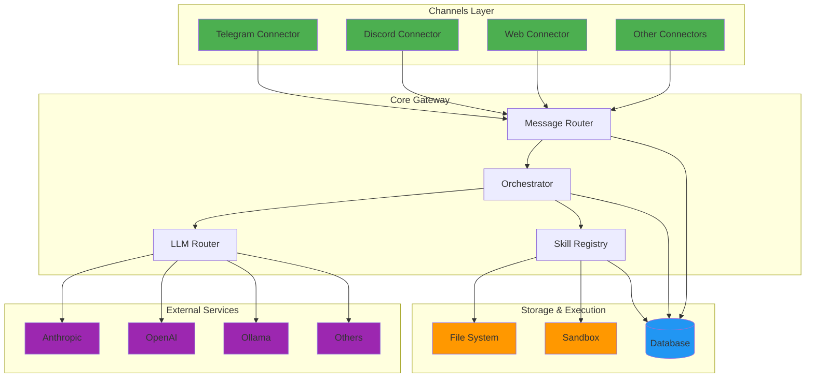
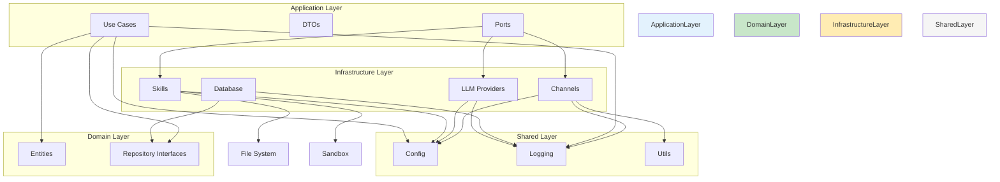
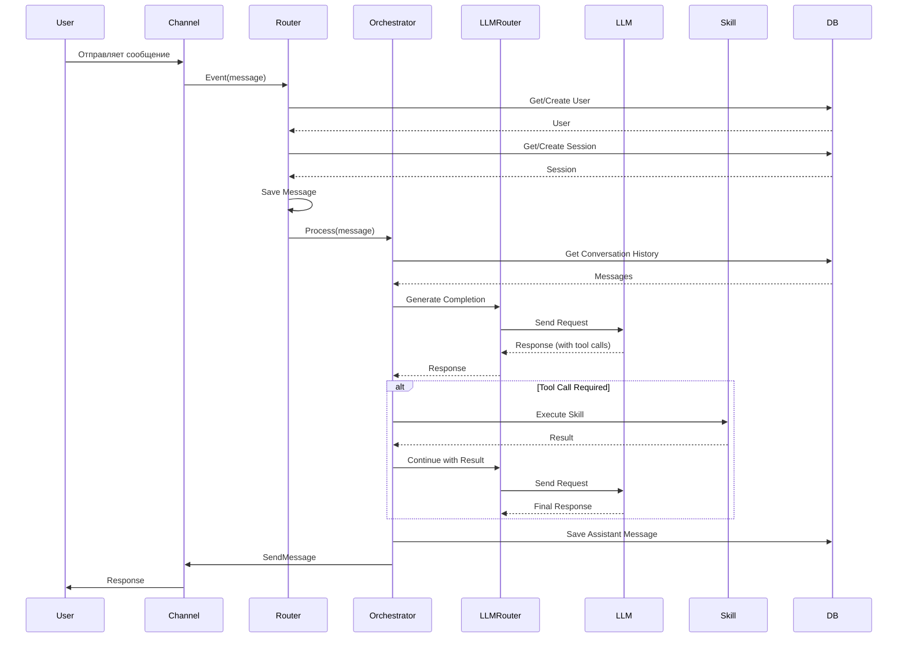
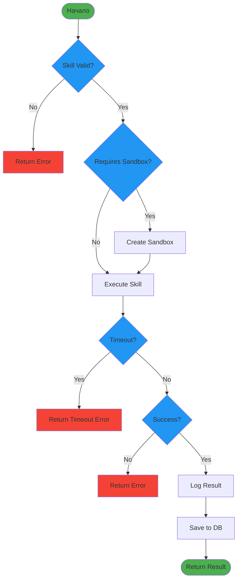
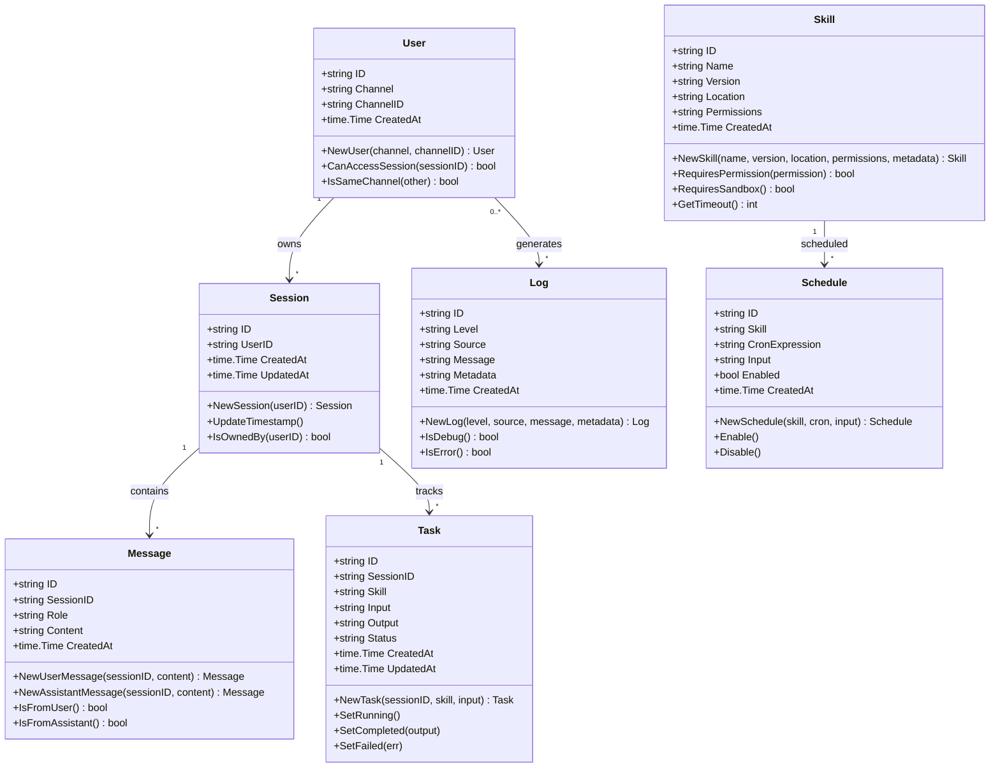
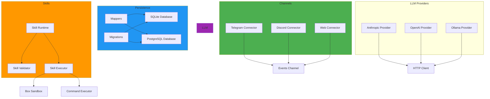
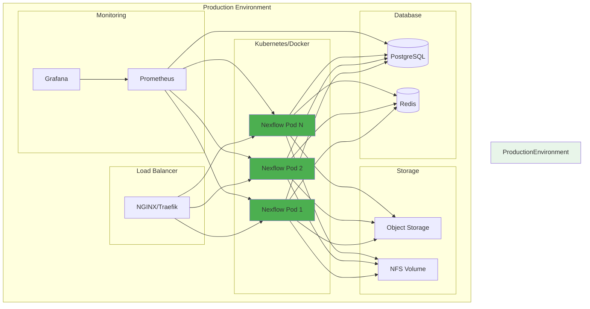
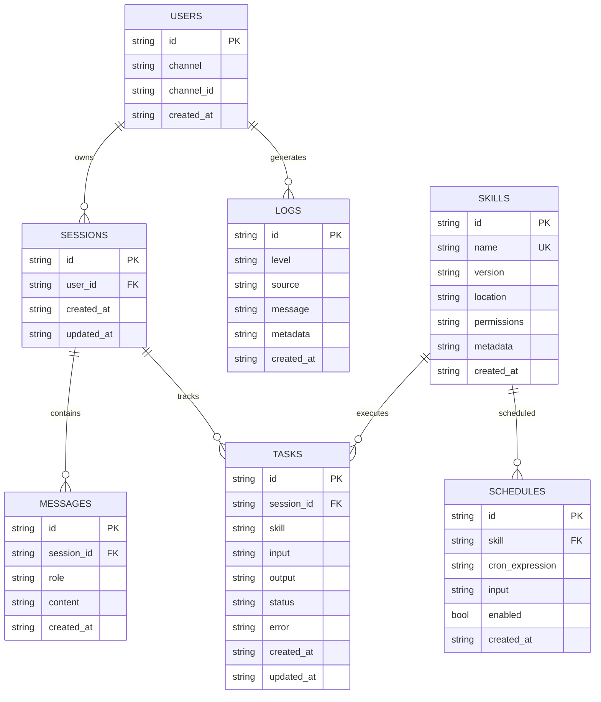
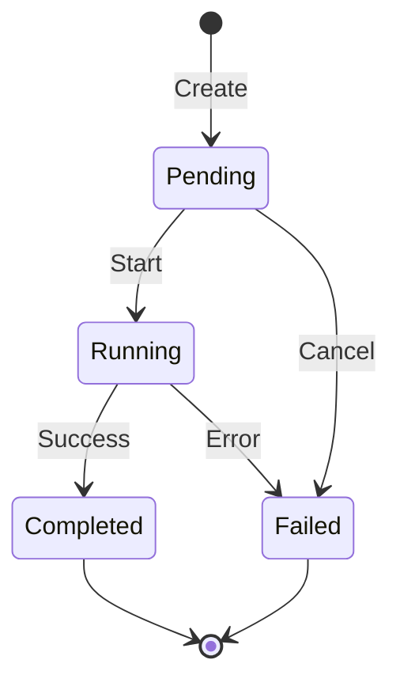
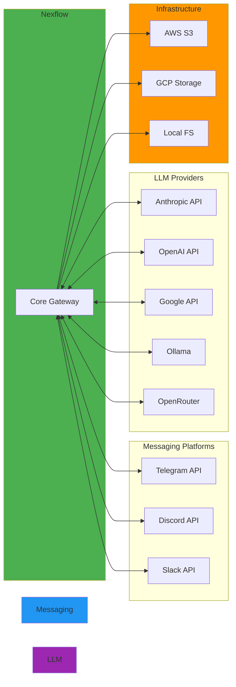

# Архитектурные диаграммы Nexflow

## Обзор архитектуры

В этом документе представлены архитектурные диаграммы проекта Nexflow.

## High-Level архитектура

## Детальная архитектура слоёв

## Flow Diagram: Обработка сообщения

## Flow Diagram: Выполнение навыка

## Class Diagram: Domain Entities

## Component Diagram: Infrastructure Layer

## Deployment Diagram

## ER Diagram: Database Schema

## State Diagram: Task Lifecycle

## Network Diagram: External Connections

