# Диаграммы потока данных Nexflow

## Обзор потока данных

В этом документе представлены диаграммы потока данных в проекте Nexflow.

## User Message Flow

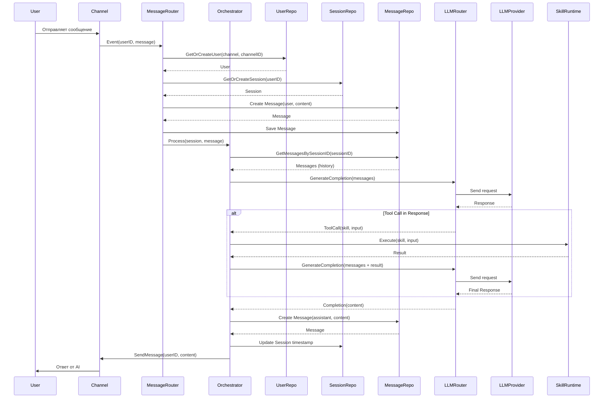

## Skill Execution Flow

```mermaid
flowchart LR
    Start([Event: Skill Request]) --> Validate[Validate Skill]
    Validate -->|Valid| CheckPerm{Requires Permissions?}

    CheckPerm -->|Yes| GetPerm[Get Permissions]
    CheckPerm -->|No| ParseCfg[Parse Config]

    GetPerm --> Sandbox{Dangerous?}
    Sandbox -->|Yes| CreateBox[Create Sandbox Box]
    Sandbox -->|No| Prepare[Prepare Execution]

    CreateBox --> Prepare
    Prepare --> ParseCfg

    ParseCfg --> GetTimeout{Has Timeout?}
    GetTimeout -->|Yes| SetTimeout[Set Execution Timeout]
    GetTimeout -->|No| Execute[Execute Skill]

    SetTimeout --> Execute
    Execute --> Monitor[Monitor Execution]
    Monitor --> Success{Success?}

    Success -->|No| LogErr[Log Error]
    Success -->|Yes| LogRes[Log Result]

    LogErr --> SaveDB[Save to DB]
    LogRes --> SaveDB

    SaveDB --> Notify[Notify Orchestrator]
    Notify --> Cleanup[Cleanup Sandbox]
    Cleanup --> Return([Return Result])

    style Start fill:#4CAF50
    style Return fill:#4CAF50
    style LogErr fill:#F44336
    style Validate fill:#2196F3
    style CheckPerm fill:#2196F3
    style Sandbox fill:#2196F3
    style GetTimeout fill:#2196F3
    style Success fill:#2196F3
```

## Data Flow: Session Management

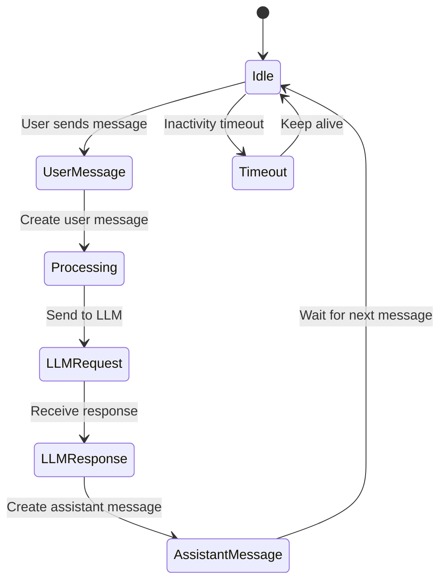

## Data Flow: User Creation

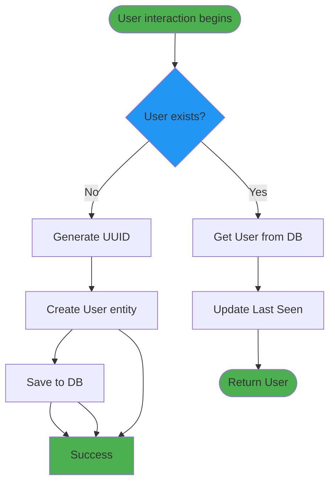

## Data Flow: LLM Routing

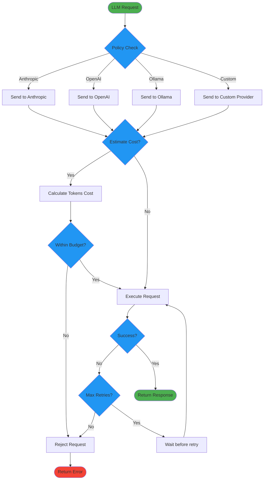

## Data Flow: Logging

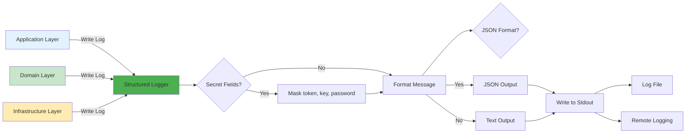

## Data Flow: Configuration Loading

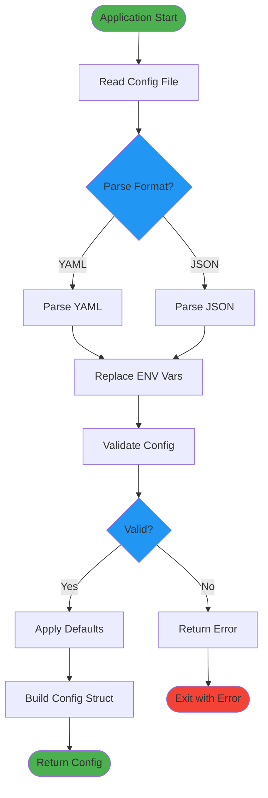

## Data Flow: Database Operations

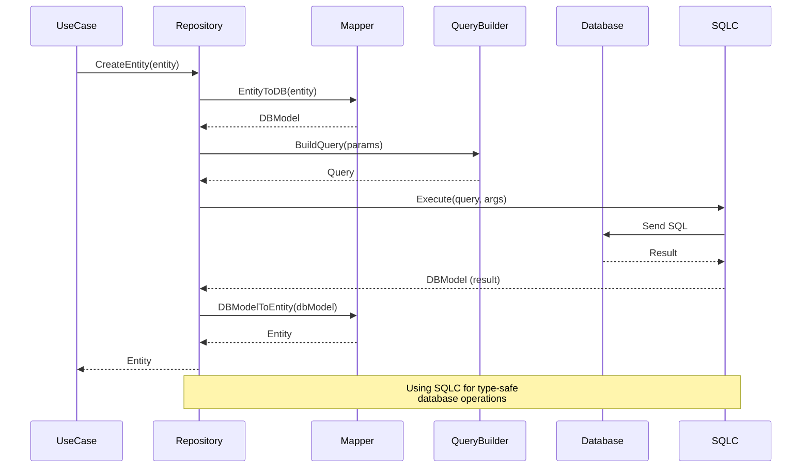

## Data Flow: Error Handling

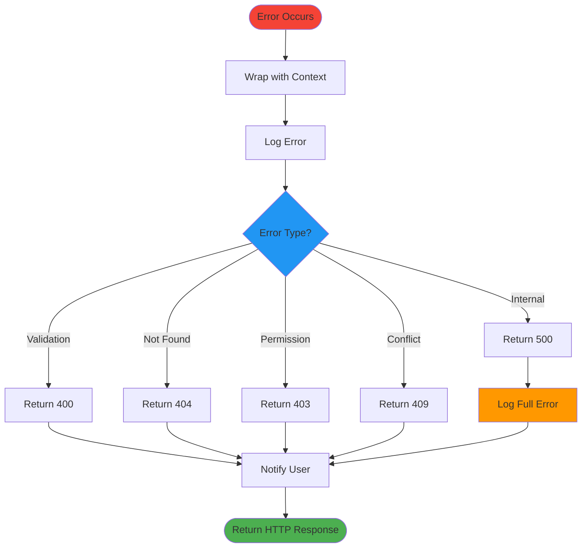

## Data Flow: Skill Discovery

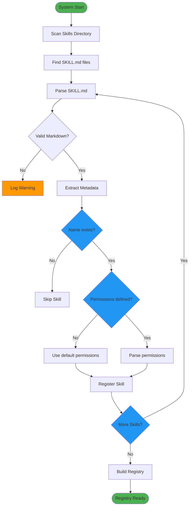

## Data Flow: Scheduled Task Execution

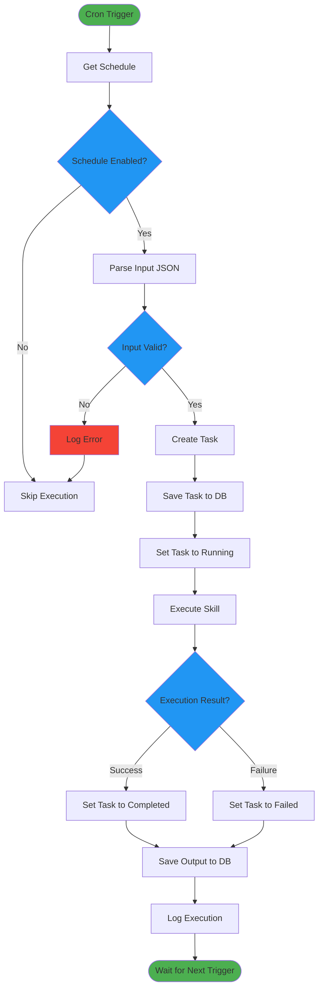

## Data Flow: Webhook Processing

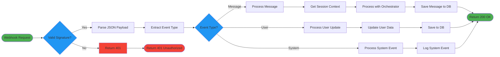

## Data Flow: Session State Management

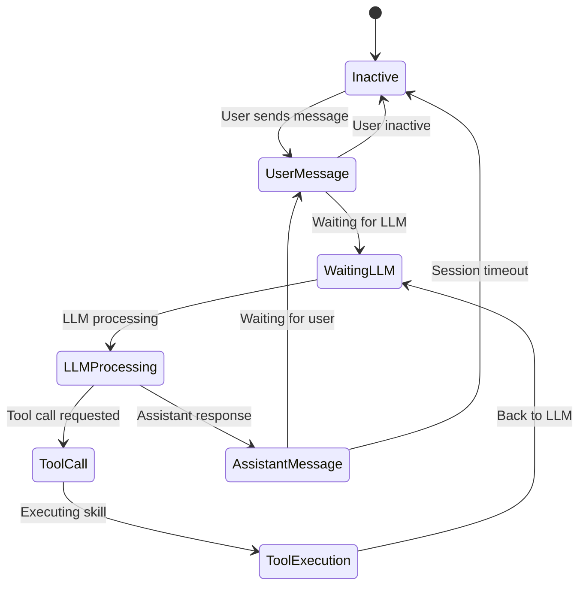
